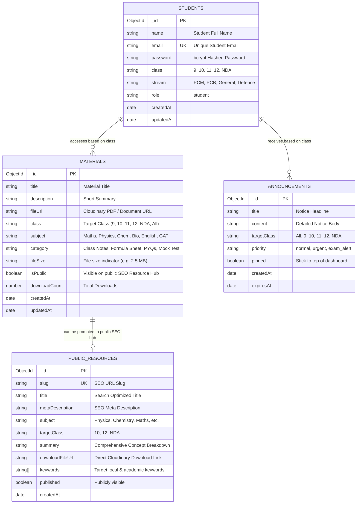

# PORTAL_SPEC.md — Student Portal Architecture & ER Specification
## SixBytes Educational Institute

**Version:** 1.0.0  
**Date:** 2026-08-19  
**Status:** Approved Specification  
**Focus:** Secure Student Resource Provider, Study Materials Hub, Notice Board & SEO Public Guides

---

## 1. Executive Summary & Purpose

The **SixBytes Student Portal** is a focused, high-performance academic resource provider engineered for enrolled students across **Class 9, Class 10, Class 11, Class 12 (PCM/PCB), and NDA & Defence Wing**. 

It provides:
1. **Secure Student Authentication**: Token-based authentication using bcrypt-hashed passwords and secure HTTP-only cookies.
2. **Centralized Study Materials Repository**: Instant filtering by Class, Subject, and Category (Class Notes, Formula Sheets, PYQ Question Banks, Mock Test Papers).
3. **In-Browser PDF Viewer & Direct Downloads**: Seamless document preview without leaving the dashboard.
4. **Notice Board & Urgent Announcements**: Real-time batch timings, test schedules, and exam updates.
5. **SEO Public Study Resource Hub (Preview)**: A dedicated public resource wing to capture organic local student searches for high-yield study materials in Dehradun.

---

## 2. Entity-Relationship (ER) Diagram



---

## 3. Database Schema Models (Mongoose)

### 3.1 Student Model (`models/Student.js`)
```javascript
const StudentSchema = new mongoose.Schema({
  name: { type: String, required: true, trim: true },
  email: { type: String, required: true, unique: true, lowercase: true, index: true },
  password: { type: String, required: true },
  class: { 
    type: String, 
    required: true, 
    enum: ["9", "10", "11", "12", "NDA"],
    index: true 
  },
  stream: { 
    type: String, 
    enum: ["PCM", "PCB", "General", "Defence", "None"],
    default: "None"
  },
  role: { type: String, default: "student", enum: ["student", "admin"] },
  createdAt: { type: Date, default: Date.now },
  updatedAt: { type: Date, default: Date.now },
});
```

### 3.2 Material Model (`models/Material.js`)
```javascript
const MaterialSchema = new mongoose.Schema({
  title: { type: String, required: true, trim: true },
  description: { type: String, default: "" },
  fileUrl: { type: String, required: true },
  class: { 
    type: String, 
    required: true, 
    enum: ["9", "10", "11", "12", "NDA", "All"],
    index: true 
  },
  subject: {
    type: String,
    required: true,
    enum: ["Mathematics", "Physics", "Chemistry", "Biology", "English", "General Science", "GAT", "All"],
    index: true
  },
  category: {
    type: String,
    required: true,
    enum: ["Class Notes", "Formula Sheet", "PYQ Question Bank", "Mock Test Paper", "Syllabus Guide"],
    default: "Class Notes",
    index: true
  },
  fileSize: { type: String, default: "PDF Document" },
  isPublic: { type: Boolean, default: false, index: true },
  downloadCount: { type: Number, default: 0 },
  createdAt: { type: Date, default: Date.now },
});
```

### 3.3 Announcement Model (`models/Announcement.js`)
```javascript
const AnnouncementSchema = new mongoose.Schema({
  title: { type: String, required: true },
  content: { type: String, required: true },
  targetClass: { 
    type: String, 
    default: "All",
    enum: ["All", "9", "10", "11", "12", "NDA"],
    index: true 
  },
  priority: { 
    type: String, 
    default: "normal", 
    enum: ["normal", "urgent", "exam_alert"] 
  },
  pinned: { type: Boolean, default: false },
  createdAt: { type: Date, default: Date.now },
});
```

---

## 4. API Endpoints & Contracts

| Method | Endpoint | Access | Purpose |
|---|---|---|---|
| `POST` | `/api/login` | Public | Authenticates student, returns user profile + session cookie |
| `POST` | `/api/logout` | Student | Clears session cookie |
| `GET` | `/api/student/me` | Student | Returns authenticated student's profile & class info |
| `GET` | `/api/material` | Student / Public | Fetches study materials (filtered by `class`, `subject`, `category`, `search`) |
| `GET` | `/api/announcements` | Student | Fetches active institute notices for the student's enrolled class |
| `POST` | `/api/material` | Admin | Uploads and registers new study material |
| `POST` | `/api/upload` | Admin | Uploads binary file (PDF/Doc) to Cloudinary CDN |

---

## 5. Security & Authentication Architecture

1. **Password Hashing**: `bcryptjs` with salt work factor 10.
2. **Session Security**: Stateless signed JWT containing `userId`, `email`, and `class`. Set via `httpOnly`, `sameSite: "lax"`, and `secure: process.env.NODE_ENV === "production"`.
3. **Authorization Middleware**: Route protection ensuring unauthenticated requests to `/dashboard` are redirected to `/student-login`.
4. **Data Isolation**: Students default to viewing materials tailored to their enrolled class, with the option to browse general reference guides.

---

## 6. Frontend UI/UX Architecture

- **Login Screen ([`/student-login`](file:///D:/sixbytes-website/app/student-login/page.jsx))**: Redesigned into the Obsidian Dark Theme with glowing ambient particles, frosted glass card, instant validation, and direct demo assistance link.
- **Student Dashboard ([`/dashboard`](file:///D:/sixbytes-website/app/dashboard/page.jsx))**:
  - **Top Bar**: Student name, class badge, search bar, and logout action.
  - **Quick Stats**: Total materials available, new notices, and bookmarked notes.
  - **Category Pills**: *All*, *Class Notes*, *Formula Sheets*, *PYQ Question Banks*, *Mock Tests*.
  - **Subject Filters**: *Mathematics*, *Physics*, *Chemistry*, *Biology*, *English*, *Defence GAT*.
  - **Material Cards Grid**: Document title, subject tag, file size, download button, and in-modal PDF preview.
  - **Notice Board Sidebar**: Pinned institute announcements and batch timing updates.
- **Public SEO Resources Page ([`/resources`](file:///D:/sixbytes-website/app/resources/page.tsx))**: Public-facing study repository targeting search queries with direct download previews and enrollment CTAs.
